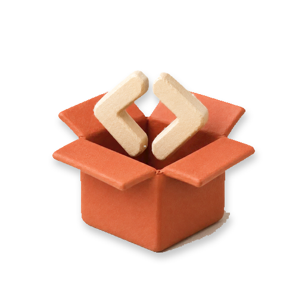

<p align="center">
  
</p>

# Crate

Crate is a private Composer registry that you run in your own Laravel Cloud account. It uses [Satis](https://github.com/composer/satis) to build package metadata and mirrored archives, then protects every download with a revocable credential. One active consumer credential can read every package the registry serves; there is no per-package access control. Crate is a small, self-hosted alternative to a hosted private registry such as Private Packagist.

## The Easy Way: Scalpels

[Scalpels](https://scalpels.app/products/crate) provisions Crate and connects it to Laravel Cloud for you. Use that path if you want a working registry without maintaining the deployment steps below.

## Run It Yourself

### Prerequisites

- Git.
- Composer 2.
- 64-bit PHP 8.3 or newer with the GMP and SQLite extensions.
- A Laravel Cloud account and a fork of this repository for deployment.
- The Laravel Cloud CLI, installed and signed in with `cloud auth`.

### Local Development

1. Clone your fork and enter the project directory:

   ```bash
   git clone https://github.com/YOUR-ACCOUNT/crate.git
   cd crate
   ```

2. Install the exact PHP dependencies recorded in `composer.lock`:

   ```bash
   composer install --no-interaction
   ```

   Composer prints `Generating optimized autoload files`, then lists the discovered packages, including `artisan-build/crate-server` and `artisan-build/crate-client`.

3. Create the local environment and SQLite database:

   ```bash
   cp -n .env.example .env
   touch database/database.sqlite
   ```

   `cp -n` preserves an existing `.env`.

4. Generate an application key and run the migrations:

   ```bash
   php artisan key:generate
   php artisan migrate --graceful
   ```

   You should see `Application key set successfully.` followed by migrations marked `DONE`.

5. Run the test suite:

   ```bash
   composer test
   ```

   The run ends with a `Tests: N passed` summary and no failures.

6. Create a local Owner, then start the development server:

   ```bash
   php artisan create-admin --local
   composer dev
   ```

   An Owner is the top-level administrator for this Crate deployment. The first command asks for an email, name, password, and password confirmation, then prints `Admin user <email> created.` The server prints `Server running on [http://localhost:8000]`. Leave it running in that terminal and open `http://localhost:8000/bfc/login` in a browser. After signing in, `/bfc/ui/credentials/personal` should show the personal credential form. Use a second terminal for the steps below.

### Deploy To Laravel Cloud

7. Create a Laravel Cloud application from your fork. Attach these resources to its environment:

   - a PostgreSQL database;
   - private object storage for package metadata and archives;
   - a managed queue for registry builds.

   Enable the scheduler so Crate can dispatch its daily rebuild, and make sure the managed queue is processing jobs. `git` must be available in the build and queue runtimes so Satis can read VCS repositories.

   Use the environment's default Cloud URL, or attach your own domain. You will use that exact URL for `APP_URL` and `CRATE_URL` below.

8. Point your checkout at your own Cloud application, then find its environment ID:

   ```bash
   cloud application:list --json --fields=id,name,organizationId -n
   cloud repo:config <application-id> --organization=<organization-id> -n
   cloud environment:list <application-id> --json --fields=id,name -n
   ```

   The first command gives you the application and organization IDs required by `repo:config`. This repository includes a `.cloud/config.json`; `cloud repo:config` replaces its defaults with your application and organization. Copy the `id` for the environment you are deploying.

9. Set only the app-specific environment values. You can use the Cloud dashboard's environment-variable settings or run:

   ```bash
   cloud environment:variables <environment-id> --action=set --key=APP_URL --value=https://crate.example.com --force -n --json
   cloud environment:variables <environment-id> --action=set --key=CRATE_URL --value=https://crate.example.com --force -n --json
   ```

   Replace `https://crate.example.com` with the Cloud URL or attached domain from step 7.

   **Never set environment variables for resources that Laravel Cloud provisions**, including the database, cache, queue, or bucket. Cloud injects their credentials and connection names. Values that you set yourself override those injected values and break the resource.

10. Set this build command in the Cloud environment settings:

    ```bash
    composer install --no-dev --no-interaction --prefer-dist --optimize-autoloader && php artisan crate:install-satis
    ```

    The build installs Satis into `satis-tool/` inside the deploy artifact.

11. Set the deploy command separately:

    ```bash
    php artisan migrate --force
    ```

    The deploy command creates Crate's database tables.

12. Deploy the environment. A successful build reports that Satis was installed at `satis-tool/bin/satis`, and the deploy finishes without migration errors.

For more detail, including traditional or VM deployments, see [`docs/deploy.md`](docs/deploy.md).

### First Use

13. Create the first Owner from the checkout you connected in step 8:

    ```bash
    php artisan create-admin --environment=<environment-id>
    ```

    The command asks for an email, name, password, and password confirmation, then prints `Admin user <email> created.` It runs against the Cloud environment you name; pass `--local` instead to create the user in your local database. Crate's own `crate:*` commands have no such option and always run where you type them.

14. Use the Cloud CLI to register a package and build the deployed registry:

    ```bash
    cloud command:run <environment-id> --cmd="php artisan crate:repos:add acme/private-package https://github.com/acme/private-package.git" -n
    cloud command:run <environment-id> --cmd="php artisan crate:build" -n
    ```

    Replace the example name and URL with your package. A private source repository also needs `--source-token=<read-only-token>`. Crate encrypts that token in its database, but a token passed through Laravel Cloud's command runner remains visible in Cloud's command history. Use a narrowly scoped, revocable token and rotate it after setup.

    `crate:repos:add` reports `Added repository [...]`. `crate:build` reports that it dispatched the Satis build. The managed queue performs the build and writes `packages.json`, provider metadata, and mirrored archives to object storage.

15. Open `/bfc/login`, sign in with the Owner account from step 13, and open `/bfc/ui/credentials/personal`. The form should offer `crate.composer.consume / basic`, a Name field, and an **Issue** button. Create the credential and look for **Save this credential now**, followed by its username and password. A credential purpose is the fixed job a credential may perform; this purpose permits Composer downloads and nothing else. Save the password because Crate shows it only once.

16. In an application that will consume the private package, configure Composer with the registry and the reveal-once password:

    ```bash
    export CRATE_URL="https://crate.example.com"
    export CRATE_TOKEN="the-reveal-once-password"

    composer config repositories.crate composer "$CRATE_URL"
    composer config --auth http-basic.crate.example.com token "$CRATE_TOKEN"
    composer require acme/private-package
    ```

    Replace `crate.example.com` in the `http-basic` key if your registry uses another host. Composer writes the password to `auth.json`; do not commit that file. Composer should print an `Installing acme/private-package` line. Its metadata and archive requests travel through Crate's protected `/packages.json`, `/p2/...`, and `/dist/...` routes.

## Configuration

### Crate Server

| Environment variable | Required | Default | Purpose |
| --- | --- | --- | --- |
| `CRATE_URL` | Yes | none | Public registry URL written into Satis metadata and archive links. |
| `CRATE_ARCHIVE_DISK` | No | `FILESYSTEM_DISK`, then `local` | Laravel filesystem disk for generated metadata and mirrored archives. |
| `CRATE_SATIS_PATH` | No | `<app>/satis-tool/bin/satis` | Satis executable. The standard build command installs it here. |
| `CRATE_OUTPUT_DIR` | No | `satis` | Directory prefix on the archive disk. |
| `CRATE_DB_HOST` | No | app database | Host for an optional separate PostgreSQL connection. |
| `CRATE_DB_PORT` | No | app database | Port for the optional separate connection. |
| `CRATE_DB_DATABASE` | No | app database | Database name for the optional separate connection. |
| `CRATE_DB_USERNAME` | No | app database | Username for the optional separate connection. |
| `CRATE_DB_PASSWORD` | No | app database | Password for the optional separate connection. |

Leave every `CRATE_DB_*` value unset to use the application's default database. On Laravel Cloud, also leave `CRATE_ARCHIVE_DISK` unset so Crate uses Cloud's injected `FILESYSTEM_DISK`.

## Troubleshooting

- **Satis says its JSON does not match the schema:** set `CRATE_URL` before running `crate:build`.
- **`satis-tool/bin/satis` is missing:** confirm the Laravel Cloud build command runs `php artisan crate:install-satis` after Composer installs the app dependencies.
- **A build stays queued:** confirm a managed queue is attached and processing jobs. Do not set `QUEUE_CONNECTION` yourself.
- **Composer receives `401 Unauthorized`:** use an active Basic credential for `crate.composer.consume`. A bearer credential, revoked credential, or credential for another purpose cannot read registry files.
- **Satis cannot clone a source repository:** confirm `git` is available and the repository's read-only source token is still valid.

## License

Crate is open-source software licensed under the MIT License.
